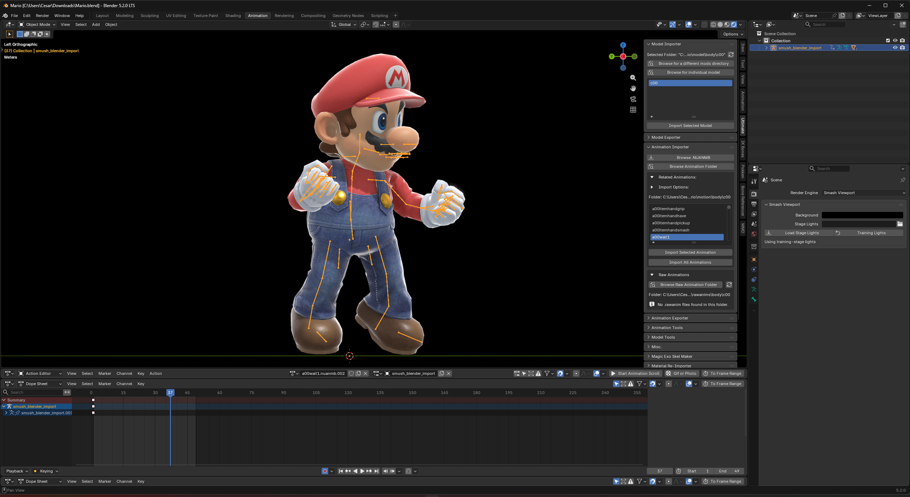
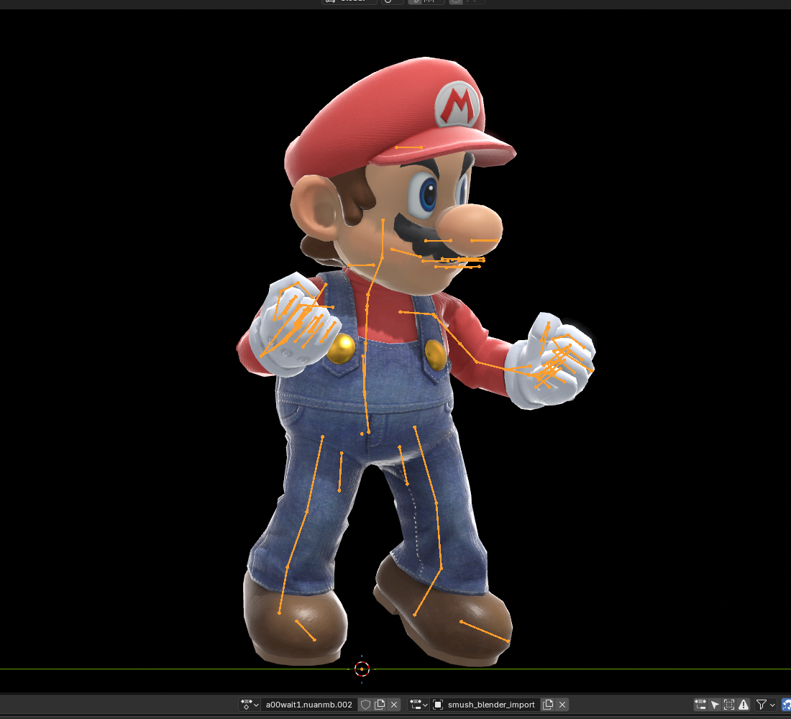
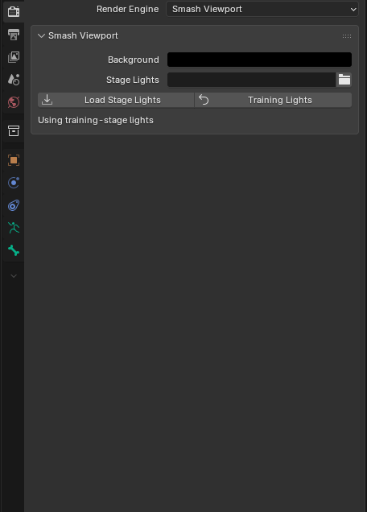
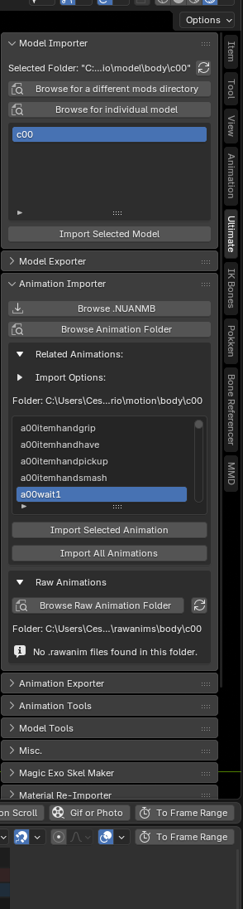
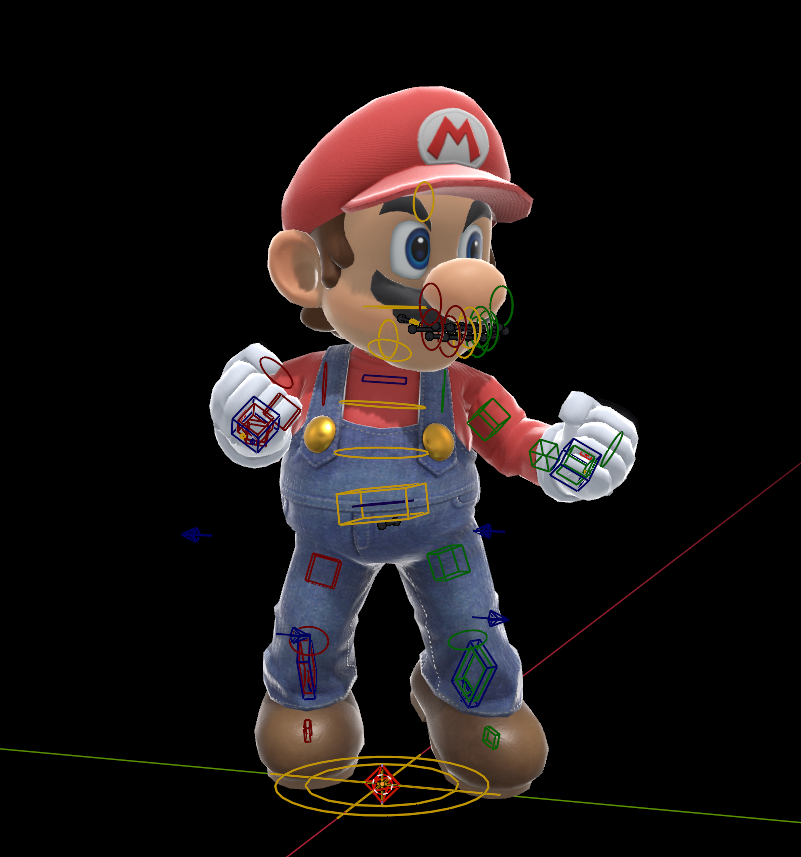
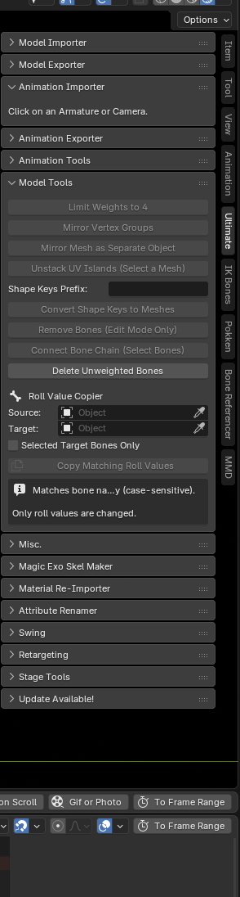

# Smash Ultimate Blender Tools (Animation Workflow)

Blender addon for Super Smash Bros. Ultimate models and animations. This is the **animation-workflow** fork of [ssbucarlos/smash-ultimate-blender](https://github.com/ssbucarlos/smash-ultimate-blender). It keeps the original import/export pipeline and adds the animator-facing tools below.

If you only need vanilla model and animation I/O, the [upstream addon](https://github.com/ssbucarlos/smash-ultimate-blender) is enough. Use this fork if you want Smash Viewport, the animation rig, folder/raw anim workflows, retargeting, facial tools, and the rest of the Ultimate tab extras.

## Smash Viewport

A custom render engine (`Smash Viewport`) that draws Smash shaders with the same `ssbh_wgpu` renderer SSBH Editor uses.

1. Properties → Render → **Render Engine → Smash Viewport**
2. In the 3D View, set shading to **Rendered** (not Solid / Material Preview)
3. Floor grid and other overlays stay under Viewport Overlays; hide them there if you want a clean black backdrop

- **Background** — clear color for the Smash draw (default black)
- **Stage Lights** — load a stage `light.nuanmb` here, or import it in Stage Tools and edit the suns live
- **Training Lights** — the default training-stage lighting (pauses Stage Tools live sync until you edit a light again)
- Smash shaders are perspective. Numpad ortho views are matched with a pulled-back perspective so lighting still works
- Non-Smash meshes (retarget sources, Jump Force, etc.) get a simple lit preview so they are not black silhouettes. Smash still comes from `ssbh_wgpu`
- **Relink Smash Model Folder** — older `.blend` files never stored the `.numshb` path. Point it at the original model folder so Smash Viewport can load that fighter again
- Importing an animation while in Solid shading re-enables armature deform on meshes a previous Smash Viewport session left disabled, so expression and face meshes follow the rig instead of floating at bind pose

Shipped native plugins (the addon updater installs these with the rest of the zip):

| OS | File | GPU API |
| --- | --- | --- |
| Windows | `native/bin/ssbh_blender_preview.dll` | DX12 |
| Linux | `native/bin/libssbh_blender_preview.so` | Vulkan |
| macOS | `native/bin/libssbh_blender_preview.dylib` | Metal (Intel + Apple Silicon) |

After a native plugin update, **fully quit Blender** (not F3 reload) so the OS can replace the loaded library. Build notes: [`native/README.md`](native/README.md).

## What this fork adds

These are the pieces that are **not** in the main plugin, or are substantially different here.

### Animation importer and exporter

Panels in the 3D Viewport's **Ultimate** sidebar tab have a small **?** in
their headers linking to documentation, including nested panels. Properties
panels and other tabs do not show these help buttons. Turn the **?** headers
off entirely with **Show Panel Help Buttons** in the add-on preferences, which
is on by default. Hover over controls for a description of their operation.

The **Ultimate Motion List** panel, under Ultimate Animation Data, reads and
updates **motion_list.bin/.yml/.yaml** alongside animation exports: a cancel
frame placed as a timeline marker, plus per-animation blend frames and Turn,
Loop, and Move flags. See [Motion list integration](docs/motion-list.md) for
detection rules, frame conventions, and backup behavior.

**Importer** (select the Smash armature or camera first):

- Imported action-name extensions are configurable in the add-on preferences: `.nuanmb` is hidden by default and `.rawanim` is shown by default

- Browse one or more `.nuanmb` files, or **Add Animation Folder** and pick from a list. Adding a parent directory discovers animation folders beneath it; linked folders and Windows junctions are supported without revisiting targets
- Switch between remembered directories using the **Folder** menu. The selected folder is associated with the active armature, and folder controls remain available when the list is empty
- Checkboxes include animations independently; clicking a name selects one, Ctrl/Cmd-click toggles, Shift-click selects a range, and Ctrl/Cmd+Shift adds a range. Repeated Shift-clicks keep the same anchor. **Select All** and **Deselect All** are also available
- **Import Selected Animations** / **Import All Animations**
- Import options: transform, material, visibility
- **Raw Animations** — browse a folder of `.rawanim` files, import selected or all (fighter `motion/body` folders auto-point at `rawanims` when present)
- In Armature Data → **Ultimate Visibility Track Entries**, use **Purge Current** or **Purge All Anims** to remove tracks with no corresponding model mesh and compact the shared list safely
- Visibility names are matched case-insensitively; case-only duplicates are merged using logical OR so an enabled state is not lost
- Importing transforms while IK is enabled matches the new motion to those limbs. Raw imports preserve existing authored target/pole channels; material/visibility-only imports skip matching. Import temporarily disables auto-key and restores it and the previous mode afterward
- Importing transforms onto a full **Animation Rig** also matches its enabled finger sliders and custom components, for single and batch imports alike. Existing controls are muted during the import so the source tracks recover, then fitted over the clip with progress in the status bar. Standalone IK Tools rigs and material-only imports do not trigger it

**Exporter**:

- Export the current action, or batch export from a matching multi-select checkbox list. Refreshing the list leaves every action unchecked; the batch button shows the selected count
- Export runs synchronously and restores the active actions, action slots, current frame/subframe, and auto-key setting after success or failure. Batch clips without SAP data no longer inherit the previous clip's SAP action
- **Export Raw Animation** and **Include Raw with .NUANMB Export** live in the **Raw Animations** panel, not here
- Bone override list, populate-from-armature, **Thrown** preset
- Bones named `BL_*` are skipped on anim (and model) export so helper controls never ship in-game

### Raw Animations

Use **Ultimate → Raw Animations** with a selected armature for editable
animation round trips. `.rawanim` stores sparse pose/IK keys instead of the
per-frame baked motion used by game `.nuanmb` files; export `.nuanmb` for the game.

Choose **Browse Raw Animation Folder**, select a clip, and use **Import Selected
Raw Animation**, or use **Import All Raw Animations**. **Import Raw Animation
File** opens an individual file directly. Refresh the list after changing files
on disk. Fighter `motion/body` folders can discover their associated `rawanims`
directory automatically.

**Export Raw Animation** saves the current animation. Enable **Include Raw with
.NUANMB Export** here, or **Also Export Raw Animation** in the Animation
Exporter, to write the unbaked clip beside single or batch game exports. The raw
file is written before the exporter prepares its bake, and only after preflight
has cleared, so a blocked export never leaves one behind.

New raw files snapshot the animation rig itself — controller bones, widgets,
constraints, drivers, rig settings, both finger control modes, and keyframe
handle types — so importing restores that setup without an FK-to-IK match. Raw
imports preserve authored target/pole channels; use a compatible armature and
inspect the imported motion before further editing or game export. Raw files
written by earlier versions cannot recover rig settings they never stored.

### Model folders and export settings

- In add-on preferences, **Model Workflow Folders** sets the default vanilla `.nusktb` browser folder and model export destination
- **Add Model Folder** maps an imported model's source directory to its export directory. A matching model destination overrides the global default; the export browser still lets you choose another location
- Model discovery follows symlinks and Windows junctions, including linked mod directories
- Remembered animation folders belong to each armature and are saved in the `.blend`. Selecting an armature or one of its skinned meshes restores that model's folder list and active folder; missing folders remain recorded, and costume-specific imports do not silently fall back to another costume
- **Auto-import Default Eyelid** in the Model Importer checks itself whenever the selected model's motion folder (`/model/body/c40/` → `/motion/body/c40/`, falling back to the shared `c00`) actually has `a00defaulteyelid.nuanmb`, and clears itself when it does not
- Model export defaults to **Order Only**: preserve vanilla bone order while using Blender's bone transforms. Choose **Order & Values** to retain vanilla transforms too. Without a selected vanilla skeleton, the export dialog uses **No Link**

Setup details: [Model workflow folders](docs/model-workflow-folders.md).

### Export Doctor

**Export Doctor** in the Ultimate tab checks model and animation export data before files are written. Use **Run Checks**, **Model Only**, or **Animation Only** to inspect a scene at any time.

- Sixteen checks cover materials and shader attributes, weights, modifiers, transforms, naming collisions, skeletons, IK/unbaked controls, action slots, camera names, frame ranges, scale inheritance, non-finite values, and missing paths
- Click a result to select its object, material, bone, or action; severity counts filter the list
- **Fix Safe Issues** applies safe fixes and reruns checks. Individual fixes are also available; rig baking requires a separate decision
- Materials with no Smash shader label are converted to a Smash material (the diffuse-only conversion, which also renames the mesh's UV and color attributes) instead of stopping the export. **Convert Non-Smash Materials** in Preflight Settings is on by default; turn it off to have the export stop on them again
- **Run Before Export** and **Block Invalid Exports** are on by default. Blocking findings stop model, single-animation, or batch-animation export before it writes files
- Missing vanilla bones and remaining IK controls warn without blocking custom rigs. Missing configured skeleton/PRC files block; missing remembered browser folders are informational
- Animation-only checks use the active export object, so exporting a camera does not inspect an unrelated model armature

### Animation Tools

- **Create Animation Rig** — control shapes on a `smush_blender_import` armature
  - Optional IK (hands, feet, poles), including extra arms such as `HandL2`
  - **Finger sliders** (thumb pad + curl/spread; extra hands get the same controls). Show sliders, Smash finger circles, or **Both** after creation; matching fits sliders for shared curl and circles for individual joint motion, and both stay active whichever set is displayed
  - **Eye look** (`BL_EyeLook` + `CustomVector31`)
  - Hide helper / swing bones, match IK to the loaded anim, clean leftover keyframes
- **Make Custom Components** — build controls for bones the standard rig does not cover: captured-pose eyes, eyelids and mouth expressions, look targets, isolated handles, extra IK chains, and rotation sliders. See [Custom animation rig components](docs/custom-components.md) and the section below
- **Rig Extras** — once a rig exists, IK, Eyes, Fingers, and Custom Components each show as Added or Missing with a one-click **Add** or **Bake & Remove**, so you can build a rig without one of them and add it later
- Remove rig, or **Bake and Remove Rig** (fingers / eyes / IK / custom components)
- **Idle Pose Library** — predefined poses come from the active animation folder and refresh when it changes. Applying reads the source clip on demand; custom stored poses remain available across folder changes. Options include Trans, mirrored, and 180 rotate. LegC and ClavicleC are never posed or keyed, because the game rejects keys on them
- **User Poses** — **Save Pose**, **Remove Pose**, and **Apply to Current Frame**, with an option to affect only selected bones
- **IK Tools** — create arm/leg IK, bake & remove IK/FK, toggle influence, **Bulk IK** on every loaded animation
- **Viewport IK buttons** — with gizmos enabled, selecting an Animation Rig IK controller draws a labeled wireframe **Switch FK** button on the visible face of its box, plus **Plant** and **Release** when floor contact is configured. They run the same keyed operators as the IK panel. Standalone IK Tools rigs do not show them
- **Hide Off-Mode Bones** — one button hides the FK bones of limbs posed in IK and the IK controls of limbs posed in FK. Toggle it off to show every limb bone; that choice sticks, and switching modes will not re-hide them until you turn it back on
- **Live Floor Contact** — calibrate heel/toe or palm/finger points, keep them above a world-Z floor, plant limbs manually or at editable markers, and optionally align rotation or adjust `Trans` height. The constraint/driver setup is live and non-destructive; calibration can be saved in Armature Collection Presets. See [Live IK floor contact](docs/ik-floor-contact.md)
- **Reverse heel lift** — leave `FootIK` and `ToeIK` in place and rotate `FootRollIK` to raise/rotate the heel and ankle around the stationary toe. For a chain such as `FootL → ToeL → BaseToeL`, the last toe bone (`BaseToeL`) stays grounded while the foot and preceding toe segment move around it. Parented toe descendants are recognized even with Blender's **Connected** option off, and they are found through the foot's hierarchy rather than by name, so rigs that split the toe into `Toe1L` / `Toe2L` instead of a plain `ToeL` still get the roll controls. `ToeIK` independently rotates the terminal toe. Fresh IK automatically sets up the corrected pivot; no repair button or floor-contact setup is needed. Exact planting requires a reachable ankle target or enabled leg stretch; live floor correction can move the whole foot. See [Live IK floor contact](docs/ik-floor-contact.md)
- **Independent toe articulation** — multi-joint feet also get `ToeBendIKL/R`. Rotate this control to bend the foot relative to the first toe joint while the toe chain remains stationary; combine it with `FootRollIK` for heel lift. Zero bend preserves the existing roll. Single-toe feet need no extra control. Matching, keying, and Bake & Remove include the new control.
- **Mirror Animation** — space, Smash Y Anim Flip, custom extra bones, **Mirror All Loaded Animations**. Newly imported actions rebuild their Smash pose cache from the source `.nuanmb` when first needed; if the source has moved, mirroring falls back to the armature-derived pose path
- **Misc Anim Stuff** (collapsible) — Transfer Hip Animation to Trans, Reset Bone Locations, Ground Character, Invert Positive and Negative, Remove Animation from Swing Bones, **GIF or Photo** (also on the Action Editor header)
- **Animation Layers** — when the Animation Layers addon is installed, its UI is embedded in a collapsible section here, and layer handlers are paused around rig edits that would otherwise crash Blender

#### Independent IK and FK

IK and FK have independent animation channels, with keyed mode values that blend between them. Full notes: [`docs/ik-fk-workflow.md`](docs/ik-fk-workflow.md).

- **Switch to IK** / **Switch to FK** per Arms, Legs, or Both. Each switch keys only the destination mode at the current frame, so opposite-mode keys on different frames blend between them. The same rows appear in Animation Rig and in IK Tools
- Creating limbs matches the current FK pose, keys IK mode at the current frame, and enables the new controls immediately. Accept the optional match dialog to copy the full FK animation into IK; FK transform keys remain intact
- **Match IK to Current Animation** appears for unmatched actions or limbs. It samples the scene frame range and writes IK controls from the FK source; use it to refresh IK after editing FK. Switching modes alone does not rematch or overwrite edited controls
- **IK Stretch Arms / Legs** is off by default. Hands and feet stay at their solved position when a target is out of reach; enable stretch to let the endpoint follow the target. The stretch buttons insert stepped state keys even when auto-key is off
- **Stretch Chain** distributes an enabled stretch offset progressively across the complete parent chain without adding scale. The root remains anchored. Each arm chain also has an independent, keyframable **ArmIK Pull** influence that draws its bend bone toward the hand target while full-chain stretch is active
- **Custom IK Bones** accepts a setup name plus a root, bend bone, and endpoint on one parent path. Custom chains cannot overlap another IK setup; they use the chosen Arms or Legs switch and participate in matching and Bake & Remove IK. Save or load their definitions as JSON presets from the same section
- Targets and poles have no parent, so they do not inherit `Trans` motion. Existing independent rigs receive endpoint constraint and driver repairs on load
- **Position IK Controls** evaluates independent limbs together, including Entire Animation, while retaining sequential matching for custom dependencies. Pose-tool refresh waits until matching finishes; solver precision and frame sampling are retained
- **Bake & Remove IK** takes a limb selection (all present IK, legs only, arms only, arms and legs), samples the evaluated motion before removing controls, and leaves unrelated limb channels alone
- Solver animation lives on hidden, nondeforming `BL_SUB_IK_*` bones; original bones blend to them through driven constraints. Hidden `BL_SUB_IK_MATCH_` bones carry the residual between the solved and the sampled pose, so a matched limb lands on the FK motion it was matched from
- Matching and pose-tool regressions: `python tests/ik_batch_matching.py` and `python tests/pose_tool_deferral.py`.

### Custom animation rig components

**Make Custom Components** opens a compact editor inside Animation Tools, below
Create Animation Rig. It walks three steps — **Bones**, **Controls**, **Animate**
— and builds one component at a time, so an unfinished entry never blocks the
rest. Full guide: [`docs/custom-components.md`](docs/custom-components.md).

- **Bone Eyes (Captured Poses)** — a look pad control, with an optional rear
  orbit pivot, authored **Left / Right / Up / Down** orbit limits, and
  interpolation that preserves the orbital arc
- **Eyelids / Blink** and **Mouth Expressions** — animate captured bone poses
  instead of shape keys. One visible controller carries a keyable **Expression**
  dropdown and a 0–1 **Strength** slider, with up to 32 named expressions per
  component and optional intermediate **checkpoints** that Strength interpolates
  through. **Both Eyelids** combines the two individual captures, clamped so a
  shared and an individual slider cannot double the closure
- **Look Target** — assigned bones track a movable target, with a selectable bone
  forward axis and no captured poses needed
- **Isolated Bones** — an independent handle per bone for feet without leg
  chains, floating hands, or props: moving Hip or Trans leaves them in place. The
  original hierarchy is retained and no solver is created; optional heel and toe
  rotation handles pivot with the controller
- **Custom IK** — select a chain, accept or change the proposed bend joint, and
  preview the path. Chains cannot overlap an existing setup. Jaw rotation, tail
  and tentacle curls, and wing and feather fans are available as rotation sliders
- **Hide Controlled Bones** hides the originals while the handles stay visible,
  and restores them when switched off or removed
- **Selected Control Appearance** restyles standard rig controls as well as
  custom ones: ten shapes, custom widget objects, nonuniform scale, offset and
  rotation, **Apply Offset / Rotation to Actual Control** to make a widget offset
  functional, and **Make Widget Mesh Editable** to edit one control's geometry in
  the viewport. Auto-save writes changes back to the current preset
- **Match Animation** in Rig Extras → Custom Components transfers the current
  action over a frame range, keying custom controls (custom IK included) while
  leaving the original bone keys intact. Hidden matching offsets carry motion no
  slider or captured expression can represent, and travel with export and Bake &
  Remove
- Definitions, captures, and widget geometry save as portable JSON presets in
  Blender's user scripts directory. **Create Animation Rig → Custom Components**
  builds a chosen preset alongside the regular rig; `.nuanmb` export samples the
  evaluated skeleton and omits controller bones

### GIF or Photo and Animation Navigation

On the Action Editor / Dope Sheet header (and in Animation Tools):

- **Start Animation Scroll** — mouse-wheel through every loaded action; the timeline jumps to that clip's range; unanimated bones go to rest (`_RET` bones are left alone)
- **Start Sequence** — plays every compatible action once, beginning at the selected action and updating the frame range for each clip
- **Ctrl+Down / Ctrl+Up** — play the next / previous compatible action; navigation wraps at both ends
- **GIF or Photo** — copies a transparent Smash Viewport (or GPU viewport) capture to the clipboard. Photo is a still. GIF records the scene range at 30 FPS (Esc cancels). Temp files are deleted when Blender closes
- **Easy Facial Animation** appears on that header when a face library is set up

The Timeline header includes FPS preset buttons. Their four values (and button visibility) are configurable in the add-on preferences.

### Model Tools

**Magic Exo Skel Maker** is a collapsible section inside **Model Tools**. Its
armature pairing and combined skeleton controls remain together there.

- Limit Weights to 4
- Mirror Vertex Groups / Mirror Mesh as Separate Object
- Unstack UV Islands
- Convert Shape Keys to Meshes (prefix)
- Remove Selected Bones, Connect Bone Chain, Delete Unweighted Bones
- **Refresh Bone Drawing** in Armature Data > Viewport Display works around invisible bones on imported rigs without retaining any rig edits
- **Roll Value Copier** — copy bone roll from a source armature to a target (name-matched, optional selected-only)

The separate [Attribute Renamer](docs/attribute-renamer.md) panel repairs first
UV/color attribute names and can rename material/image datablocks. Read its
scope carefully: the material and image commands affect the whole blend file.

### Texture optimization

Select an object with an Ultimate material, then use **Optimize Textures** in its material UI. Choose which assigned images to resize and how many times to halve each dimension; the dialog previews dimensions and total pixel reduction. Zero steps keeps the original size, and dimensions never fall below one pixel.

Shared images are resized once and change in every material using them. Built-in defaults, linked images, unsupported image types, and unavailable data are skipped. Results support Undo and are packed into the file; **save the `.blend`** to keep them. Export textures afterward to write the resized `.nutexb` files.

### Materials

The Material Properties editor contains **Ultimate Material Data** and its
shader parameter groups. Start with a shader label or convert a Blender
material, then edit booleans, floats, vectors, textures, samplers, blend states,
and rasterizer states in their respective sections. Use **Copy From Other
Material** to reuse settings. **Material Re-Importer** reloads model materials
from disk. Animated material values live in the armature's animation data.

See [Material Re-Importer](docs/material-reimporter.md) for folder selection,
material-label matching, and copying material assignments between armatures.

### Swing physics

Use **Swing** to import or export swing physics data. Define chains with start
and end bones, edit individual bone physics, and assign collision shapes to the
chain's bones. The collision sections manage spheres, ovals, ellipsoids,
capsules, planes, and connections. Bone and chain presets reuse physics values;
inspect the mapping before applying a chain preset to a different skeleton.

Select an armature in the viewport, then open **Ultimate → Swing** to access
the import/export controls. Edit the imported data in the armature's **Object
Data Properties → Ultimate Swing Data**. Bone Properties shows chain membership
and collisions for an active swing bone. Swing chain bones must start with
`S_`; terminal `_null` bones are needed by the chain but carry no individual
physics settings. Inspect the chains and collision assignments before exporting.
The sidebar's Swing exporter writes physics data separately from model and
animation exports.

### Armature Collection Presets

The **Armature Collection Presets** panel in the Ultimate tab saves and restores an armature's organization and viewport setup. Presets can include scene collections and object placement, materials, bone collections, bone colors/custom shapes, and armature display settings. Each section can be enabled independently.

- Choose a **Blend File**, **Global**, or **Custom** preset library. Configure the custom directory in the add-on preferences.
- Select an armature and use **Save New** to capture it. Related descendants are included by default; custom-shape objects are optional.
- Use **Preview** to inspect matches without changing the file, then **Apply** to review the same mapping and apply it with Undo support.
- Matching is exact/case-insensitive and understands Blender suffixes such as `.001`. Optional fuzzy matching defaults to an 85% threshold and requires explicit approval of the displayed mappings.
- Unmatched objects stay where they are unless **Move to Unmatched** is selected.
- Presets preserve multiple object collection memberships and nested bone collections. Applying never deletes objects or collections and does not disturb collection links belonging exclusively to other scenes.
- The list supports search, refresh, best-match selection, update, duplicate, rename, delete, multi-file import, and export.
- **Link to Model Folder** associates a preset with one folder name in a model's import path. Import automatically applies the closest unique match; ambiguous matches warn and are skipped. Leave the link blank to disable it. Updating preserves the link; duplication clears it.

### Easy Facial Animation

Opens from the Action Editor header, Ultimate Animation Data, or its own window.

- Vis-mesh and bone-based expression tabs
- Capture / apply expressions with thumbnails
- Save/load a JSON expression library
- Face camera create / view / remove
- Preview assigned vis tracks

Bone-driven eyes, eyelids, and mouth expressions built from captured poses live
in [Custom animation rig components](docs/custom-components.md) instead, and are
keyed through their own Expression and Strength controls.

### Misc.

- **Eye Look (CustomVector31)** — set up EyeL/EyeR tracks, add `BL_EyeLook`, match from material, bake, live preview (Solid Texture / Material). Look At vs offset mode, gain/sensitivity, clamp, invert, pupil size from control-bone scale. Live preview does not export; bake writes the keys export reads
- **Convert All to Principled BSDF** / **Revert to Smash Material** on the imported armature
- Smash Viewport toggle/status (same engine as Render Properties)

### Retargeting

The **Bind To** and **Expy Mapping** controls are embedded directly in
**Retargeting**. Custom Bones, Core, Arms, Legs, Fingers, and Root are dropdown
sections inside that same panel, so they stay together when the sidebar is reordered.

Expy Kit lives in the Ultimate tab (always listed; most operators want Pose Mode).

- Smash auto-preset for `smush_blender_import`
- Save/load bone-map presets
- Map by proximity from a reference armature
- Bind, conversion, bake constrained actions

### Stage Tools

- Import/export stage `light.nuanmb`, viewport preview, edit intensity/color on selected lights
- **Drive Smash Viewport** (on by default) — Import Light Nuanmb also loads that file in Smash Viewport. Rotate `LightStg0` / change intensity or color and Smash Viewport updates after a short delay. **Training Lights** or **Load Stage Lights** in Render Properties pause live sync until you edit a Stage Tools light again
- Ambient SH `.shpcanim` import/export, intensity/tint, vertex-paint local ambient, bake multipliers
- **Import Battlefield Reference** adds stage geometry for judging fighter size and movement. Enter the fighter's in-game scale; the stage uses its reciprocal (a 0.5-scale fighter gets a 2× reference) and faces -X. The scale stays editable on a root empty in a separate reference collection; repeated imports add another reference. Reference geometry is not part of model export

### Animation data and Blender 4 / 5

- Ultimate Animation Data still drives vis and material tracks
- SAP action auto-sync so vis/mat stay attached to the current action
- Action slots / fcurve helpers for Blender 4 and 5
- `ParamLabels.csv` lives outside the addon so updates do not wipe custom hashes (`%APPDATA%/Smash Ultimate Labels` on Windows)
- **Append New Hashes** adds lowercase bone names, `bonecol` collision names, and child mesh names in a responsive batch; additional CSV destinations are configurable in the add-on preferences

### Panel Presets

**Panel Presets** at the bottom of the Ultimate tab controls the whole layout of the tab: which panels are visible *and* what order they appear in.

- **All Panels**, **Animate**, and **Modeling** ship built in; add, duplicate, rename, and delete your own
- The panel list is a single checklist: tick a panel to show it, and use the up/down arrows beside the list to move it. The reset arrow restores the add-on's default order for that preset
- Each preset carries its own order, so switching presets relays out the tab
- **Save Presets** writes them to your Blender config so other `.blend` files pick them up; presets also travel inside a saved `.blend`
- Changes apply immediately. Panel Presets itself is never hidden or moved — it stays pinned at the bottom so a bad preset is always undoable
- Layout restoration preserves child panels and works with Simple Tabs' renamed categories. An optional [Simple Tabs startup patch](patches/simple-tabs-immediate-startup.patch) is supplied for that separate add-on; it is not applied automatically

### Import, export, and matching performance

Model import converts textures concurrently and groups vertex-weight writes. Animation import caches track data and avoids repeated pose evaluation where bone inheritance permits it; visibility drivers are replaced cleanly instead of accumulating duplicate variables. Model export reduces mode changes and mesh processing, while texture export uses up to four external encoders with temporary-file cleanup.

IK matching is exact against its FK source: `BL_SUB_IK_MATCH_` correction bones
key the residual between the solved and the sampled pose, so the deform bones
land on the FK motion they were matched from. Whole-animation matching samples FK
from F-Curves instead of stepping the scene frame and runs the pole search on a
minimal isolated copy of the rig, roughly halving match and import times; both
fall back to ordinary scene evaluation whenever their guards cannot prove the fast
path is equivalent. Component matching shares one dependency-graph update per
parent level, and finger matching fits sliders linearly with batched circle
corrections.

A bundled [Rust IK accelerator](native/ik_match/README.md) is enabled by default
on Windows x64 under Blender 4.5 and 5.2 and roughly halves those times again.
Every other platform, Blender version, and unsupported rig or constraint setup
keeps Blender's own solver. Untick **Use Native IK Accelerator** in the add-on
preferences to turn it off, or set `SUB_NATIVE_IK=0` (off everywhere) or
`SUB_NATIVE_IK=1` (verify every native result against Blender), which override
the preference. Results are measured against Blender's backend rather than proven
identical to it, so use `=0` or `=1` where exactness must be guaranteed.

Set `SUB_IK_DIAG=1` for per-stage match timings, candidate counts, and the rate
at which the accelerator hands chain-frames back to Blender.

### Helper bones (`BL_*`)

Use the `BL_` prefix for custom helper bones that should be excluded from model and animation export. Internal solver bones already use `BL_SUB_IK_*`, but named hand/foot targets and poles can use names such as `HandIK` or `KneeIK`. Bake and remove IK through the provided operators before final export; Export Doctor warns when IK bones remain. The prefix excludes a bone, but does not bake its effect onto the exported bones.

## Shared with the main plugin

Still here, documented on the [upstream wiki](https://github.com/ssbucarlos/smash-ultimate-blender/wiki):

- Import/export of `.numdlb`, `.numshb`, `.nusktb`, `.nuhlpb`, `update.prc`, `.numeshexb`, `.adjb`, `.numatb`, `.nutexb`, `.nuanmb`, `swing.prc`
- Batch `.nuanmb` import from the file browser, plus Ctrl-click/Shift-click multi-selection in the loaded animation-folder list
- Camera `.nuanmb`
- Magic Exo Skel Maker (build, preview modifiers, un-exo, bone align, weight transfer, cleanup)
- Material Re-Importer, Attribute Renamer, swing collision editing
- Vis/mat drivers and the original eye modal
- Smash material conversion (Principled BSDF and Fortnite FPv3 `_D` / `_M` / `_S` maps)

## Installation

Tutorials for the shared import/export flow are on the [wiki](https://github.com/ssbucarlos/smash-ultimate-blender/wiki).

1. Download this fork, not the upstream zip
   - Latest: GitHub → [CrusherD2/smash-ultimate-blender](https://github.com/CrusherD2/smash-ultimate-blender) → branch **`animation-workflow`** → Code → **Download ZIP**
   - Or a specific commit from that branch
2. Blender → Edit → Preferences → Add-ons → Install From Disk → pick the zip
3. Enable **Smash Ultimate Blender Tools**
4. In the 3D Viewport, open the Sidebar (`N`) and open the **Ultimate** tab. **If the tab is missing, switch to Object or Pose mode** (Edit Mesh hides most of these panels). Model Importer/Exporter, Swing, Material Re-Importer, Attribute Renamer, and Magic Exo Skel Maker are available in Pose mode too, not just Object mode
5. If a panel you expect is missing while the tab is visible, check the active preset in **Panel Presets** at the bottom of the tab

## System requirements

64-bit **Blender 4.4+** and **Blender 5.x** on Windows, Linux, and macOS (including Apple Silicon). Smash Viewport needs a working DX12 / Vulkan / Metal GPU stack on those platforms.

If Blender runs but the addon will not enable, open an issue on [this fork](https://github.com/CrusherD2/smash-ultimate-blender/issues).

## Updating

### Auto-updater

This fork watches the **`animation-workflow`** branch (not GitHub Releases). The check runs in the background at startup. When the branch has a higher add-on version (`bl_info['version']`), a popup shows that version's patch notes with **Update Now**, **Remind Me Later** (asks again next launch) and **Skip This Version** (quiet until a newer version is published). **Update Available!** also appears in the Ultimate tab. Equal or older remote versions, or versions that cannot be read, never count as an update. Installing restarts Blender, and it offers to save unsaved changes first.

- **Patch notes** come from [`CHANGELOG.md`](CHANGELOG.md): add a `## <version>` section when bumping the version. If there is no matching section, recent commit messages are shown instead. After an update installs, a one-time **What's New** popup shows the new notes.
- **Blender requirement:** if the update's `bl_info['blender']` is newer than the running Blender, there is no popup. The panel says which Blender version is required and disables installing.
- **Turning the popup off:** Preferences › Add-ons › Smash Ultimate Blender Tools › Plugin Updates › *Show Update Popup*. A skipped version can be cleared there too.

Version comparison uses the exact remote commit being checked. A local build with an equal or higher version keeps the panel hidden; use manual installation if you intentionally want a different build with the same version.

Smash Viewport binaries ship in that zip. After an update that changes them, quit Blender completely once so the new `.dll` / `.so` / `.dylib` can load.

### Manual update

Disable the addon, restart Blender, Remove, then install the new zip.

## Uninstalling

Disable the addon, restart Blender, then Remove.

## In case of problems

1. Export issues: run **Export Doctor** in the Ultimate tab, then consult [wiki: export issues](https://github.com/ssbucarlos/smash-ultimate-blender/wiki/Read-this-if-you-have-export-issues.-Or-want-to-avoid-Export-Issues)
2. [Known issues](https://github.com/ssbucarlos/smash-ultimate-blender/wiki/Known-Blender-Issues)
3. Fork-specific bugs: [CrusherD2/smash-ultimate-blender issues](https://github.com/CrusherD2/smash-ultimate-blender/issues)

## Useful tools

- SSBH Editor — https://github.com/ScanMountGoat/ssbh_editor
- Ultimate Tex — https://github.com/ScanMountGoat/ultimate_tex
- Switch Toolbox — https://github.com/KillzXGaming/Switch-Toolbox

## Special thanks

- SMG for [ssbh_data_py](https://github.com/ScanMountGoat/ssbh_data_py), SSBH Editor / `ssbh_wgpu`, and CrossMod shader reference
- [ssbucarlos/smash-ultimate-blender](https://github.com/ssbucarlos/smash-ultimate-blender) for the original addon
- The Rokoko plugin for UI patterns used in the exo panels
- Expy Kit, which the Retargeting tab embeds
